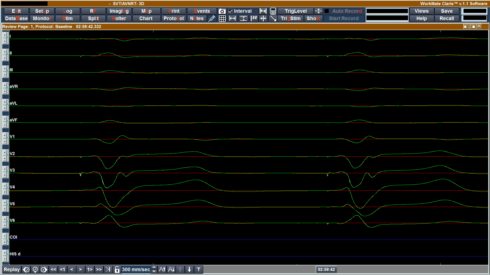
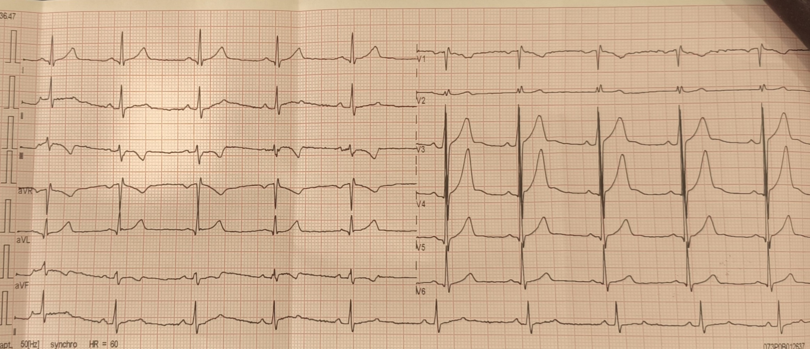
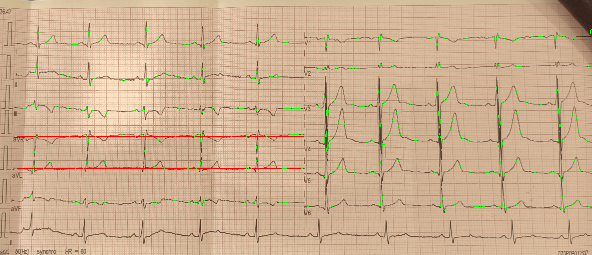

# ECG Signal Extractor

A classical computer vision tool for extracting digital ECG signals from ECG images.

The program takes ECG screenshots or scanned ECG records, detects the visible ECG traces, converts them into numerical signal values, and saves the result as CSV files. It was developed for cases where the original digital ECG data is not available and only a visual record of the examination can be used.

The project uses only classical image processing methods. No machine learning is used.

---

## Examples

### Screenshot input

<p align="center">
  
</p>

### Screenshot extraction result

<p align="center">
  
</p>

### Scanned ECG input

<p align="center">
  
</p>

### Scan extraction result

<p align="center">
  
</p>

---

## Features

- extraction of ECG signals from image files;
- support for 12 standard ECG leads:
  - `I`, `II`, `III`,
  - `aVR`, `aVL`, `aVF`,
  - `V1`, `V2`, `V3`, `V4`, `V5`, `V6`;
- two processing modes:
  - `screen` for clean software screenshots;
  - `scan` for scanned or photographed ECG records;
- CSV export for every processed image;
- debug images for checking the extraction quality;
- automatic baseline estimation for every lead;
- heart rate estimation from detected R peaks;
- classical OpenCV-based processing without neural networks.

---

## Repository structure

```text
.
├── ecg_extractor.py        # Main program
├── screenshots/            # Example screenshot inputs
├── scans/                  # Example scanned/photo inputs
├── results/                # Example generated CSV files
├── requirements.txt        # Python dependencies
├── README.md
└── LICENSE
```

---

## Installation

Clone the repository:

```bash
git clone https://github.com/krukich/ecg-signal-extractor.git
cd ecg-signal-extractor
```

Create a virtual environment:

```bash
python3 -m venv .venv
```

Activate it:

```bash
source .venv/bin/activate
```

Install dependencies:

```bash
pip install -r requirements.txt
```

The project requires Python 3.10 or newer.

---

## Usage

The program is run from the command line.

### Screenshot mode

Use this mode for ECG screenshots with the expected software layout.

```bash
python ecg_extractor.py --input_dir screenshots --output_dir results --mode screen
```

### Scan mode

Use this mode for scanned or photographed ECG records.

```bash
python ecg_extractor.py --input_dir scans --output_dir results --mode scan
```

### Arguments

```text
--input_dir    Directory with input ECG images
--output_dir   Directory where CSV files and debug images will be saved
--mode         Processing mode: screen or scan
```

If `--mode` is not provided, the program uses screenshot mode by default.

---

## Output

For every processed image, the program saves a CSV file with the extracted ECG signal.

Example output:

```text
results/
├── P3_1.csv
├── P5_1.csv
├── P6_1.csv
├── P7_1.csv
└── debug/
```

The CSV file contains numerical samples of the extracted ECG leads.  
Each column corresponds to one ECG lead.

Example terminal output:

```text
Processing: P3_1.JPG
Using px_per_ms=1.130000 (screen_reference)
Saved: results/P3_1.csv
BPM: 70.0 (V4)
```

The program also saves debug images that make it easier to inspect whether the ECG trace was detected correctly.

---

## Method overview

The extraction pipeline is based on several image processing steps.

For screenshot inputs, the program uses the known structure of the ECG software layout. The signal is detected as a dark trace on a bright background. The image is thresholded, grouped by columns, and then the most likely ECG trace is selected for each lead.

For scanned or photographed ECG records, the image is first corrected and normalized. The program handles page perspective, rotation, grid visibility, shadows, and local contrast changes. After preprocessing, the ECG signal is extracted using a similar tracing approach.

The baseline is estimated from the extracted signal itself using the median level of each lead. This makes the method more stable when the calibration pulse is unclear, partially visible, or unreliable.

Heart rate is estimated from the extracted signal by detecting R peaks and calculating the average interval between consecutive peaks.

---

## Processing modes

### `screen`

The screenshot mode is intended for clean ECG screenshots exported from the original software.  
It assumes a stable image layout and uses fixed geometry derived from the reference examples.

Typical use case:

```bash
python ecg_extractor.py --input_dir screenshots --output_dir results --mode screen
```

### `scan`

The scan mode is intended for photographed or scanned ECG pages.  
It includes additional preprocessing for rotation, perspective, background normalization, and grid-based scaling.

Typical use case:

```bash
python ecg_extractor.py --input_dir scans --output_dir results --mode scan
```

---

## Heart rate estimation

The program estimates heart rate after signal extraction.

The algorithm searches for strong R peaks in the extracted ECG signal, applies a refractory interval to avoid detecting the same beat multiple times, and calculates BPM from the average distance between detected peaks.

Example results from test images:

```text
P3_1.JPG        BPM: 70.0
P5_1.JPG        BPM: 90.2
P6_1.JPG        BPM: 121.5
P7_1.JPG        BPM: 60.5
ekg_photo.jpg   BPM: 60.9
```

---

## Limitations

The program is designed for ECG images with a layout similar to the provided examples.

It may require adjustments if:

- the ECG layout is significantly different;
- the image has very low resolution;
- the signal is strongly blurred;
- the ECG trace overlaps heavily with text or grid lines;
- the scan is strongly distorted or partially cropped;
- the paper contains strong shadows or reflections.

The tool should be treated as a digitization aid, not as a medical diagnostic system.

---

## Requirements

Main dependencies:

```text
opencv-python
numpy
pandas
```

Install them with:

```bash
pip install -r requirements.txt
```

---

## License

This project is licensed under the MIT License.